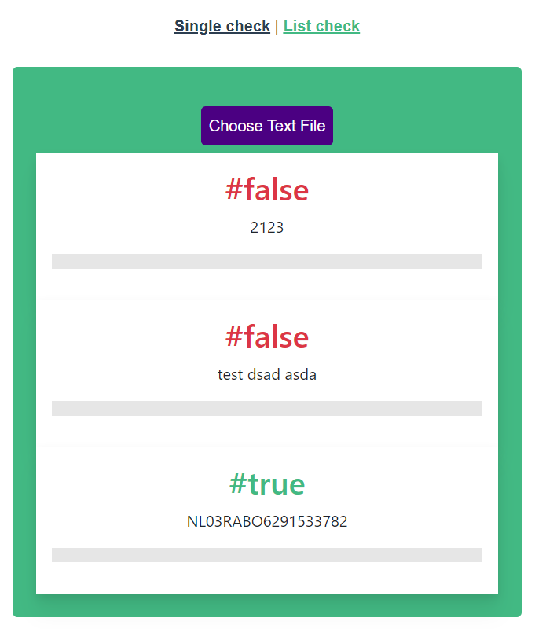
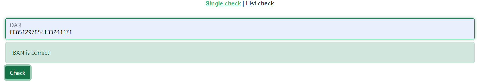

# Documentation

### Technologies
- Vue 3
- TypeScript

### How to use?
There is two pages, one is for single IBAN input, second is for uploading text file with IBANs(one IBAN per line in .txt file)

### Features

- Check IBANs if they are correct
- Single IBAN check
- List of IBANs check

### Instructions
- To run test use: npm run test:unit
- To run my app on your computer - go to https://keen-wiles-3b7173.netlify.app/ : or download my project from Github
### Text file upload with IBANs (1 IBAN per line)

### Single Iban check


## Project setup
```
npm install
```

### Compiles and hot-reloads for development
```
npm run serve
```

### Compiles and minifies for production
```
npm run build
```

### Run your unit tests
```
npm run test:unit
```

### Lints and fixes files
```
npm run lint
```

### Customize configuration
See [Configuration Reference](https://cli.vuejs.org/config/).
